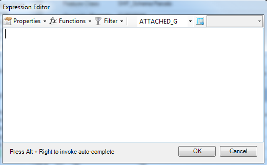
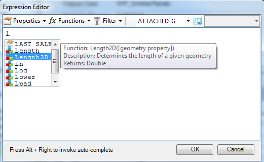

# The Expression Editor

MapGuide has a built-in expression language, which allows for flexible computations based off of existing feature class property values to be used for various Layer stylization purposes.

Some uses of expressions include:

 * The **Hyperlink** property of a Layer Definition being the concatenated expression of several string properties.
 * The **Tooltip** property of a Layer Definition being the concatenated expression of several string properties and fragments of html content.
 
Maestro provides an Expression Editor that can assist in writing these FDO expressions. Any resource editor field that can accept an FDO expression will give you the option of using this editor.

The **Properties** toolbar button lists all the available feature class properties.

The **Functions** toolbar button lists all the available expression functions.

The **Filter** toolbar button lists all the available conditional and filtering expressions.

Also on the toolbar is the ability to fetch all distinct values for a given property. To do this, select the desired property in the first dropdown, then click the arrow on the right to load
all the distinct values into the second dropdown.

> [!NOTE]
> The types of functions and expressions available depend on the underlying FDO provider's capabilities. For example, editing a Tooltip expression on a Layer Definition will only use functions
> and expressions supported by the Feature Source the Layer Definition is referencing.

The Expression Editor also has built-in auto-complete that brings up possible property/function suggestions as you type. You can invoke auto-complete at any time by pressing `Alt` + `Right key`

