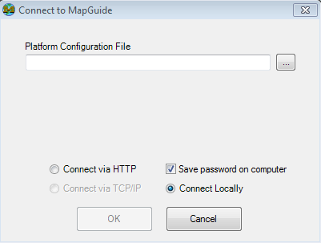
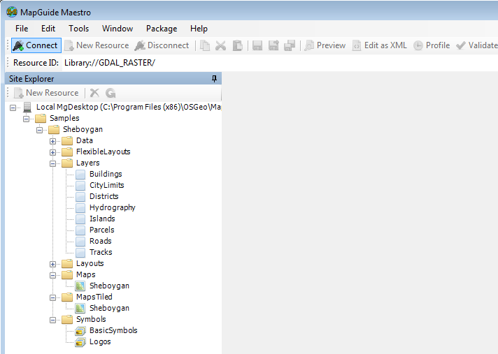

.. _local-connection-mode:

# The Local Connection Mode

The Local Connection Mode is a new feature of Maestro that allows you to work with a resource repository that is local on your machine.

The Local Connection Mode is designed for the following user scenarios:

 * Authoring resources and spatial data locally without requiring any connectivity to a MapGuide Server
 * Authoring/editing resources for a `mg-desktop <http://trac.osgeo.org/mapguide/wiki/mg-desktop>`_ based application

> [!NOTE]
> The Local Connection Mode feature is only available on Windows.
    
> [!NOTE]
> The physical location of the local repository is situated in: %APPDATA%\MgLocal\Repositories

To connect to your local repository, select the **Connect Locally** option.

    *Connecting to the local repository*

For the **Platform Configuration File**, select the **Platform.ini** file in the Maestro installation directory. Then click **OK** to connect to your local repository.

At this point, your local repository functions pretty much like a MapGuide Server repository. You can load packages into this repository and you can package data from this repository.

> [!NOTE]
> If the **Connect Locally** option is disabled on Windows, you can enable it by running **LocalConfigure.exe** in your Maestro installation directory. This program is automatically run the first time Maestro is run (after installation)