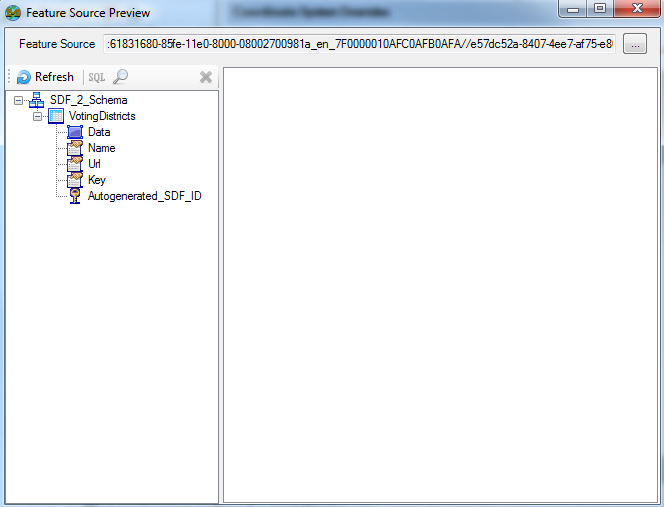
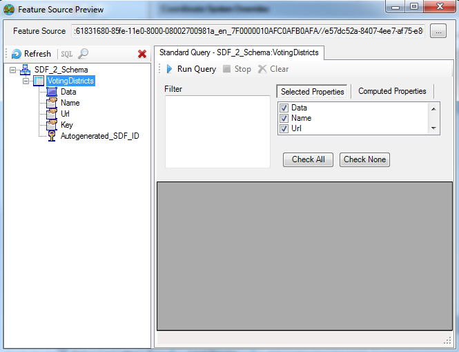
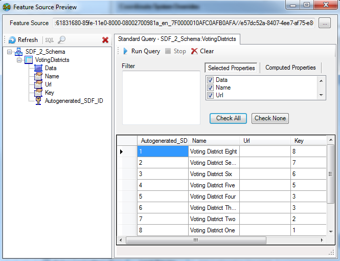

.. _local-fs-preview:

# Using Local Feature Source Preview

> [!NOTE]
> Server support for the operations used by this tool have questionable reliability for MapGuide Open Source 2.1 and older releases 
> (and corresponding MapGuide Enterprise versions). As such, this tool is only recommended for use in MapGuide Open Source 2.2 (MapGuide Enterprise 2011)
> and newer releases.

The **Preview** toolbar command when used on a Feature Source editor will bring up a web-based schema inspector on that Feature Source.

This schema inspector allows you to view the Feature Classes in the Feature Source with the ability to either view the data attributes or 
preview the data as rendered on a map with basic styles applied.

However this schema inspector is very basic in its functionality. You cannot for instance, do any of the follwing:

 * Run or test certain feature queries on a Feature Source to see what kind of result we get back.
 * Similarly, run or test certain SQL queries on a Feature Source for FDO providers that support such capability.
 
Maestro includes a **Local Feature Source Preview** tool that is designed to overcome such limitations of the web-based
schema inspector.

This tool is available:

 * From the *Tools* menu
 * On the Maestro Start Menu folder if you installed Maestro via the windows installer.
 * In the Feature Source editor under the **Other Options** panel.

Once again like **MgCooker**, this tool requires you to login on startup. Once logged in select the feature source
to be previewed. Once the feature source is selected, the left pane will be populated with all feature schemas found
and their Feature Classes (and their properties)

To open a specific feature class for running queries, select the desired Feature Class node (represented by a table/spreadsheet).

Two buttons on the toolbar will be activated when you do this:

 * The SQL query command (indicated by the SQL icon)
 * The feature query command (indicated by the magnifying icon)
 
Click either one to open the query interface.

From here specify an optional filter (which is a FDO filter expression), and optionally check/uncheck the properties
you want to show as part of the query result, and any computed properties. Computed properties are FDO expressions.

Once you have specified your query parameters, click **Run Query** to execute the query.

> [!NOTE]
> Avoid issuing feature queries without a filter, large result sets being transferred over http can bring heavy 
> load to a MapGuide Server and the Web Tier.

To close any query interface, click the close button on the left pane toolbar (indicated by a cross).