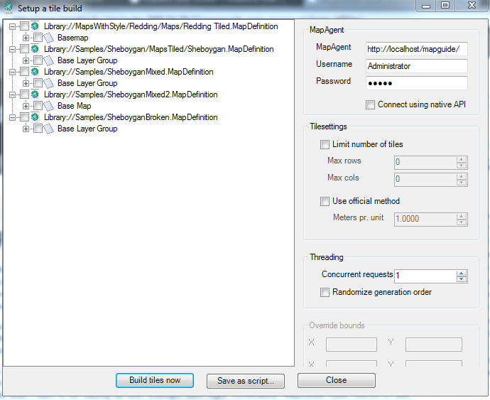

# Using MgCooker

> [!NOTE]
> A new tile seeder tool **MgTileSeeder** is in development that will supercede and eventually replace the **MgCooker** tool. For
> information on how to use **MgTileSeeder**, see :ref:`using-mgtileseeder`

Tiled Maps improve display performance by rendering the maps in tiles and keeping them stored in a special directory
known as the **Tile Cache**. Subsequent views of the same map area will skip the rendering process and serve the already
rendered tiles from the **Tile Cache** which is much faster. Having these tiles pre-generated up front allows you to
get a view of the map in a near instant, because the potentially costly rendering operations are avoided.

**MgCooker** is such a tool to allow you to pre-generate these tiles. **MgCooker** is available from the **Tools** menu in Maestro

> [!NOTE]
> If you installed Maestro via the installer, **MgCooker** is also available on the Maestro Start Menu folder.

**MgCooker** requires you to login on startup. Once logged in, it will show the list of Map Definitions with
tiled layers.

From here, tick the Map Definitions and the Base Layer Groups that you want to pre-generate tiles for.

In addition other settings are available for you:

 * You can set the upper limit of the number of tiles to generate
 * You can customize the tile generation method.
 * You can configure how many threads to generate tiles. Each thread effectively simulates an end-user looking at your specified tiled maps. Based on the method chosen, the way the simulated user navigates could be systematic or completely random.

Once you have specified you settings you have the following options:

 * Start the tile generation process by clicking **Build tiles now**. This process can take several hours to several days depending on the size of the maps being pre-generated.
 * Save this out to a windows batch file, which will execute MgCooker from the command-line with your specified settings. This is useful for automation via the **Windows Task Scheduler**