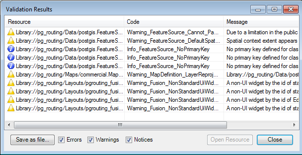

.. _resource-validation:

# Resource Validation

.. index::
    single: Resources; Validating
    
Resource integrity is a very important issue when authoring and publishing data in MapGuide. Doing
something as innocuous as deleting a resource may inadvertently break any number of resources that 
may be depending on it.  

There are other common scenarios that can cause resource breakage:

 * You have edited or removed a column in a database table from a Feature Source that is referenced by one or more layers. Rendering of this layer may either break or be incorrect.
 * You have renamed a Layer Definition that one or more Map Definitions reference.
 * You have deleted a custom command in a Web Layout that is referenced in a toolbar or menu

Most of these scenarios result in usually the same outcome: **You don't see things on the map that you would normally expect to be there.**

Fortunately, MapGuide Maestro provides a powerful Resource Validation facility that you can use to validate a given
resource against such common scenarios. To validate a resource, right click it in the **Site Explorer** and select
the **Validate** context menu item.

Upon completion of validation, any warnings or errors are displayed in a dialog for you to review

 *Validation Results Dialog*

Any information or warnings encountered during validation do not affect display of the map. These are generally about performance, source data and
non-sensical (but not error-causing) configuration values.

> [!NOTE]
> Resource Validation is automatically done by resource editors before saving a resource. If you are confident
> in your authoring capabilities, this may be unnecessary. An option is available for you to turn this off.
