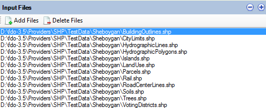
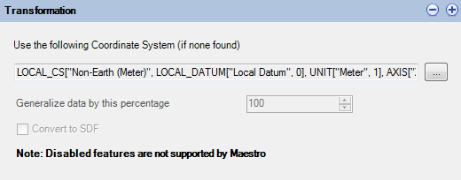
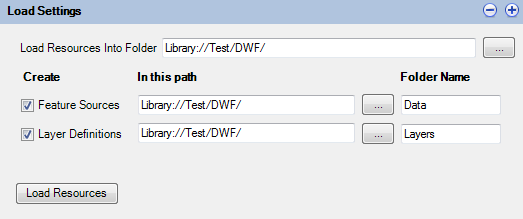

# Understanding Load Procedures

Load Procedures are resources which describe how to load a certain set of data files into the MapGuide Server.

Load Procedures are a very quick way to load spatial data files into MapGuide or to refresh existing resources. However, unlike MapGuide Studio, Maestro only
supports a subset of the features exposed by the Load Procedure schema. See :ref:`maestro-differences` for more information.

This section will cover the Load Procedure Editor

## Source Files

The source file section of the editor shows all the source data files that the Load Procedure will load when executed

You can add or remove files from this list. 

> [!NOTE]
> When executing a Load Procedure, Maestro will look for the source files on the **machine running Maestro**, and not the machine that's running the MapGuide Server.
> Keep this in mind when executing this Load Procedure from another Maestro installation.

## Transformation Settings

The transformation settings section of the editor shows all the data transformation options available for the Load Procedure.

Elements that are disabled are not supported by Maestro and are ignored during execution.

Transformation settings vary from different Load Procedure types.

## Load Settings

The load settings section of the editor allows you to specify where the generated resources will be loaded into.

Clicking **Load Resources** will execute the Load Procedure with the current settings.