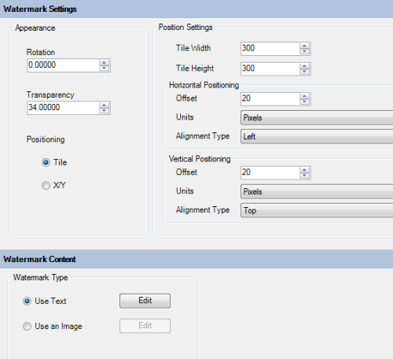
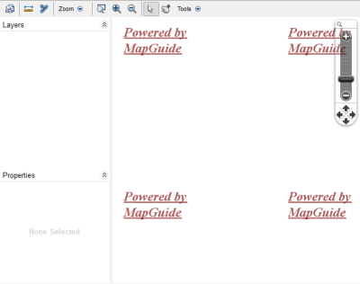
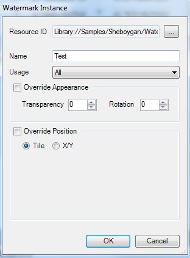

# Understanding Watermarks

Watermarks allow your Maps and Layers to be "branded" with text or images of your choosing

## The Watermark Definition Editor

The Watermark Definition Editor allows you create your own watermarks

Watermarks can be either text or images and in terms of appearance can be a single instance at a specific position, or tiled at repeat horizontal and vertical intervals of your choice.

Previews are supported by the Watermark Editor. Previewing the watermark will launch an empty map with your watermark settings

## The Watermark Instance Collection Editor

The Watermark Instance Collection Editor allows you to attach watermark definitions to a Layer or Map Definition. If the schema version of the Layer or Map Definition supports Watermarks ( >= `2.3.0` ), the respective resource editor will include this Watermark Instance Collection Editor allowing you to attach watermarks to the respective layer or map.

Each Watermark instance you add can have its appearance and/or positioning settings be overridden with values specific for this layer or map. 

If you add Watermark instances without overriding any appearance/positioning settings, the default settings from the originating Watermark Definition will be used.